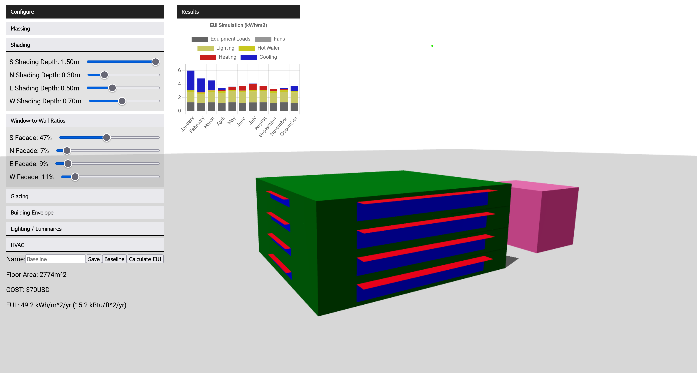

# Building Energy Use Intensity Simulation Game

WIP!!!!!!!!!

Back-end for web-browser implementation of the EUI Simulation Game played in MIT 4.464: Environmental Technology in Buildings.

Front-end found in this repo: [sim-game-react](https://github.com/szvsw/sim-game-react)

The front-end client connects to the back-end via websockets as implemented in the [Socket.io](socket.io) library.

The back-end passes data from clients to Rhino+Grasshopper+ClimateStudio via OSC over UDP (using [node-osc](https://www.npmjs.com/package/node-osc) and [Firefly](https://www.food4rhino.com/en/app/firefly))

## Scripts

Bootstrapped with [express-generator](https://expressjs.com/en/starter/generator.html), so the usual scripts:

`npm run start`
